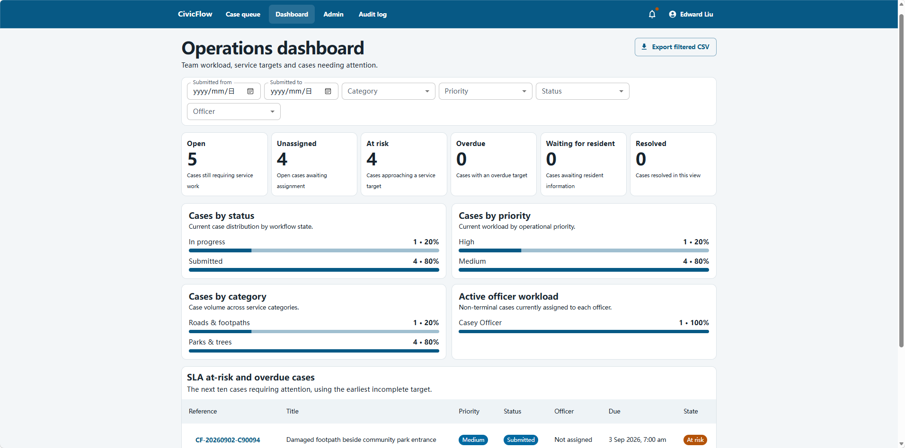
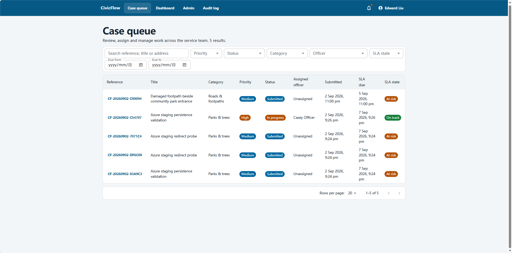
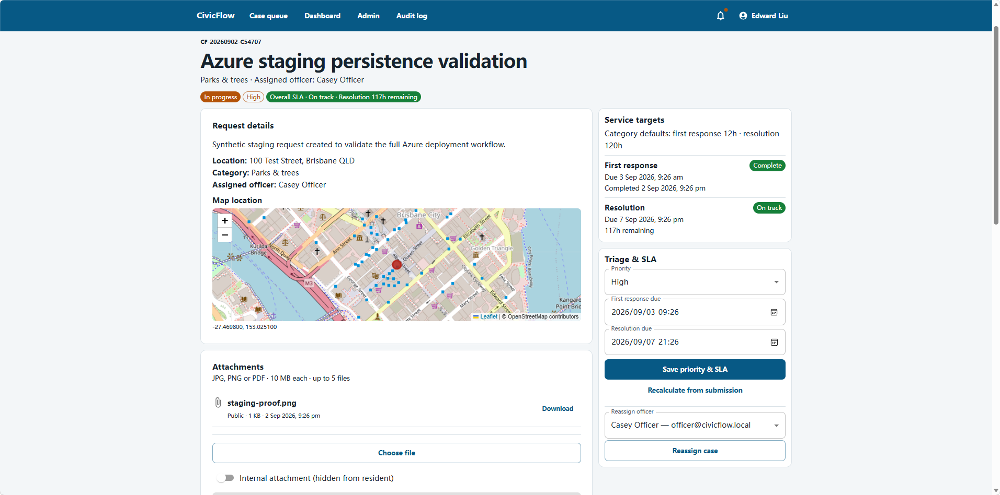
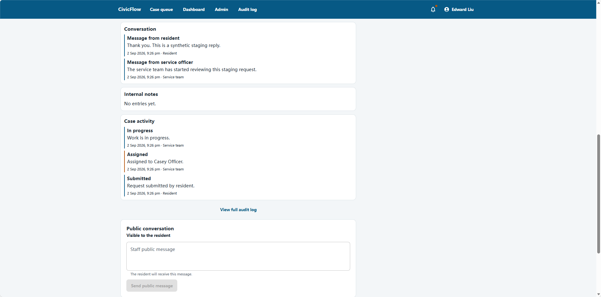
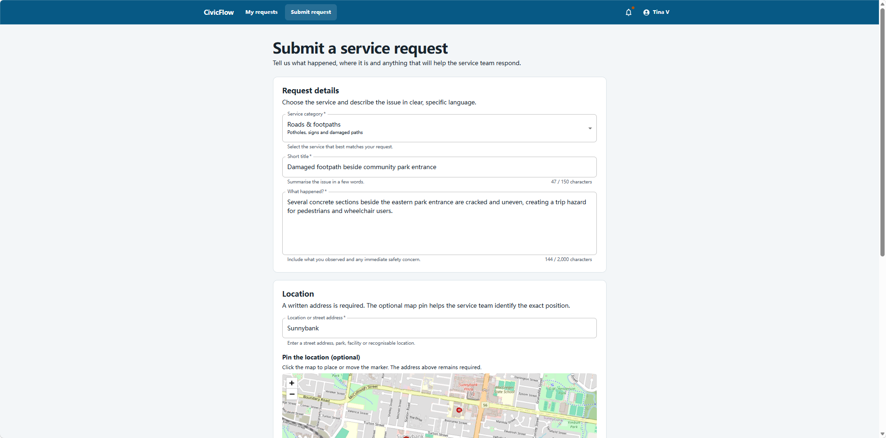
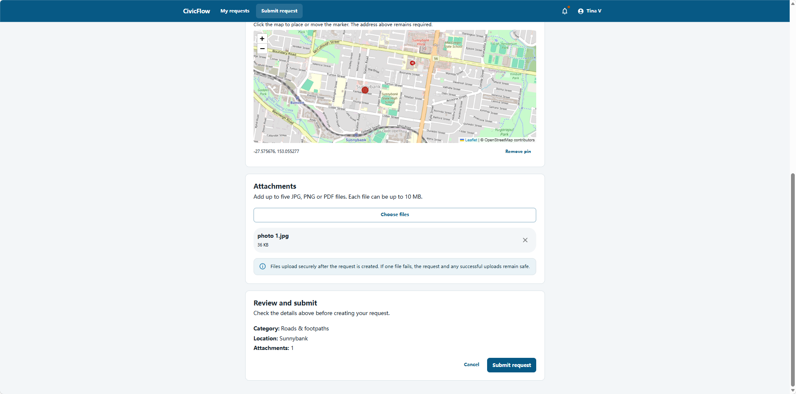
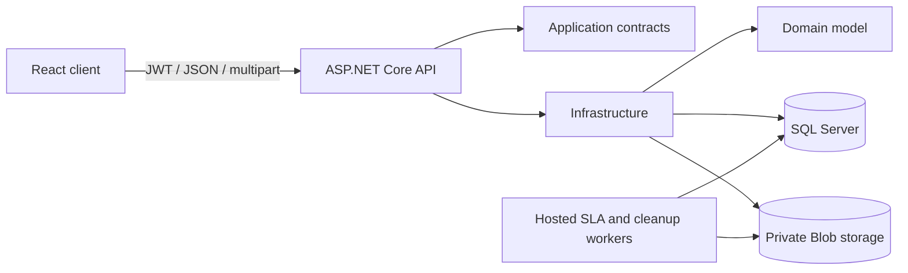

# CivicFlow

CivicFlow is a full-stack civic service request and case-management application. Residents report community issues and follow progress while operational teams triage, assign, communicate, resolve, and audit work against transparent service targets.

> Independent portfolio project. CivicFlow is not affiliated with the Queensland Government or any government organisation.

**Live demo:** [Open CivicFlow on Azure](https://agreeable-island-0434b7f00.6.azurestaticapps.net)

## Product tour

These original screenshots were provided by the project owner and contain synthetic demonstration data. No staff credentials or private operational data are published.

### Operations dashboard



*Monitor open cases, unassigned work, SLA risk and officer workload through a filterable operational dashboard.*

### Case queue



*Search and filter service requests by priority, status, category, assigned officer and SLA state.*

### Case triage and assignment



*Review request details, set operational priority and service targets, assign officers and manage protected attachments.*

### Communication and case history



*Separate public resident communication from internal notes while preserving a chronological case activity record.*

### Resident request submission





*Residents can select a service category, describe the issue, provide a location or map pin, attach supporting files and review the request before submission.*

## Product workflow

| Role | Workflow |
| --- | --- |
| Resident | Register, submit a request with an optional map point and attachments, exchange public messages, receive notifications, and reopen a resolved case. |
| Case Officer | Work only assigned cases, exchange public messages, keep internal notes, request information, resume work, and resolve with a summary. |
| Team Manager | Search and triage the enterprise case queue, change priority/SLA, assign officers, monitor workload, and export filtered CSV data. |
| System Administrator | Manage users and service categories and inspect the immutable, filterable audit log. |

Key engineering features include API-enforced RBAC and resident isolation, first-response and resolution SLAs, role-specific activity projections, idempotent notifications, optimistic concurrency, audited workflow transitions, private Blob attachments with failure compensation, and optional Leaflet/OpenStreetMap locations.

## Technology

| Layer | Technology |
| --- | --- |
| Client | React 19, TypeScript 5.9, Vite 8, Material UI, React Router, React Leaflet |
| API | C# 14, ASP.NET Core 10 controller API, OpenAPI, JWT authentication |
| Persistence | EF Core 10 migrations, SQL Server 2022, ASP.NET Core Identity |
| Files | Private Azure Blob Storage in production; Azurite locally |
| Delivery | Docker Compose, Azure Static Web Apps, Azure Container Apps, GHCR, PowerShell developer launcher, GitHub Actions |
| Tests | xUnit domain, API integration, real SQL Server, and storage smoke tests |

## Architecture



The backend is a modular monolith. Domain objects own workflow invariants; the API owns authentication and role-specific projections; Infrastructure owns Identity, EF Core, SQL Server and Blob implementations. See [architecture decisions](docs/architecture.md), [API reference](docs/api-reference.md), [migration runbook](docs/migration-runbook.md), and [attachment security](docs/attachment-security.md).

## Local development on Windows

### Prerequisites

- Git 2.45 or later
- .NET SDK 10 (`global.json` selects 10.0.100 with feature-band roll-forward)
- Node.js 24 and npm
- Docker Desktop with either `docker compose` or `docker-compose`
- PowerShell 5.1 or later

### Clone and configure

```powershell
git clone <repository-url>
cd civicflow-case-management
Copy-Item .env.example .env
```

Edit `.env` and replace every `REPLACE_WITH...` value. Use unique local values; `.env` is ignored by Git. The JWT key must contain at least 32 random bytes. Never reuse development credentials in a deployment.

Alternatively, configure the API with .NET User Secrets and export only `MSSQL_SA_PASSWORD` for Docker Compose:

```powershell
dotnet user-secrets set 'ConnectionStrings:CivicFlowDatabase' '<local-connection-string>' --project src/CivicFlow.Api
dotnet user-secrets set 'Jwt:Key' '<at-least-32-random-bytes>' --project src/CivicFlow.Api
dotnet user-secrets set 'DemoAccounts:Enabled' 'true' --project src/CivicFlow.Api
dotnet user-secrets set 'DemoAccounts:Password' '<local-demo-password>' --project src/CivicFlow.Api
```

### One-command start

```powershell
Set-ExecutionPolicy -Scope Process Bypass
.\start-civicflow.ps1
```

The launcher detects the installed Docker Compose form, starts SQL Server and Azurite, waits for health checks, then starts the API and client. On a new Development database, EF Core applies migrations and creates categories plus local demo accounts once. Existing databases and users are not reseeded.

- Client: `http://localhost:5173`
- API: `http://localhost:5168`
- Health: `http://localhost:5168/health`
- OpenAPI JSON in Development: `http://localhost:5168/openapi/v1.json`

### Manual start

Load the three values from `.env` into environment variables, then start infrastructure:

```powershell
docker compose up -d # use docker-compose if the plugin form is unavailable
$env:ASPNETCORE_ENVIRONMENT = 'Development'
$env:ConnectionStrings__CivicFlowDatabase = 'Server=localhost,1433;Database=CivicFlow;User Id=sa;Password=<local-password>;Encrypt=False;TrustServerCertificate=True'
$env:Jwt__Key = '<at-least-32-random-bytes>'
$env:DemoAccounts__Enabled = 'true'
$env:DemoAccounts__Password = '<local-demo-password>'
dotnet run --project src/CivicFlow.Api
```

In another terminal:

```powershell
Set-Location src/CivicFlow.Client
npm ci
npm run dev
```

The login page shows local demo account email addresses only in Vite Development mode. Their password is the value set in `CIVICFLOW_DEMO_PASSWORD`; no demo password is committed or shown by a production build.

### EF Core migrations

Development startup applies migrations automatically. Design-time commands require an explicit connection string:

```powershell
$env:ConnectionStrings__CivicFlowDatabase = '<local-design-time-connection-string>'
dotnet ef migrations list --project src/CivicFlow.Infrastructure --startup-project src/CivicFlow.Api
```

Production startup fails when migrations are pending. Production releases use a reviewed migration bundle; legacy Phase 2 baseline registration is opt-in and guarded by semantic schema validation. Follow the [migration runbook](docs/migration-runbook.md)—never delete or recreate an existing database to upgrade it.

## Tests and quality checks

The current release candidate contains 11 domain/unit tests, 46 API integration tests and 31 frontend component/accessibility tests. Integration tests use isolated EF InMemory storage by default and can run against a supplied real SQL Server database without deleting it.

### Frontend Experience V1

The responsive React experience now provides role-projected desktop and mobile navigation, consistent loading/error/empty states, keyboard-accessible case links, route-level code splitting, resident-focused request and conversation views, staff workbench cards, responsive administration and audit views, and self-service Profile & Security. Search inputs retain URL-based filters and browser history while debouncing API requests. Attachment actions are rendered only from the API-provided `canDelete` capability; the DELETE endpoint always reauthorizes independently.

Accessibility checks cover semantic navigation, visible focus, keyboard interaction, responsive layouts and axe serious/critical rules for representative authentication, resident, staff and audit surfaces. Published product screenshots use synthetic public-demo data and follow the privacy checklist in [`docs/screenshots/README.md`](docs/screenshots/README.md).

```powershell
dotnet restore CivicFlow.sln
dotnet build CivicFlow.sln -c Release --no-restore
dotnet test tests/CivicFlow.UnitTests -c Release --no-build
dotnet test tests/CivicFlow.IntegrationTests -c Release --no-build

Set-Location src/CivicFlow.Client
npm ci
npm run lint
npm run build
npm audit
```

For real SQL integration, set `CIVICFLOW_TEST_SQL` to a dedicated test database connection string. Tests create uniquely identified records and never drop, recreate, or reseed that database.

## Security model

- Authorization is enforced by the API; hiding UI controls is not considered security.
- Residents can access only their own cases. Internal notes and Internal attachments never enter resident DTOs.
- Officers can access only assigned cases; Manager and Administrator privileges are explicit.
- Blob containers remain private. Downloads use an authorized API with safe disposition, `nosniff`, length, and ETag headers.
- JPG, PNG, and PDF uploads are checked by extension, media type, signature, decoded image dimensions, size, count, and sanitized filename.
- Blob-first uploads compensate storage if the database transaction fails. Per-case locking prevents attachment-limit races.
- Refresh tokens are random and stored as SHA-256 hashes. Important writes produce immutable audit records.
- No secret, connection string, storage key, or private Blob URL is returned in API DTOs or application logs.

See [SECURITY.md](SECURITY.md) before deploying. This project is a portfolio-quality reference implementation, not a certified government production service.

## Azure staging architecture

The public staging architecture uses Azure Static Web Apps Free for the Vite client, Azure Container Apps Consumption for the API, the Azure SQL Database free offer, and a private Standard LRS Blob container. The API uses system-assigned Managed Identity for SQL and Blob access. GitHub Actions publishes the public API image to GHCR and deploys both application surfaces without committed cloud credentials.

Cost controls include a monthly budget, SQL free-limit auto-pause, Container Apps scale-to-zero with a single-replica maximum, capped Log Analytics ingestion, and no ACR, NAT Gateway, Private Endpoint, Defender plan, or paid support plan. Follow the [Azure staging runbook](docs/azure-deployment.md). The earlier [Railway runbook](docs/railway-deployment.md) remains as historical deployment documentation.

## Troubleshooting

- **`docker compose` is unavailable:** install/update Docker Desktop or use `docker-compose`; the launcher supports both.
- **Port 1433, 10000, 5168, or 5173 is busy:** stop the conflicting process or change the local port mapping and matching configuration.
- **SQL Server/Azurite never becomes healthy:** inspect `docker ps` and container logs; confirm Docker Desktop has sufficient memory.
- **API reports missing JWT/database configuration:** ensure `.env` exists, contains no `REPLACE_WITH` values, and start through the launcher or export the documented variables.
- **Migration/schema validation fails:** stop and follow the migration runbook. Do not use `EnsureDeleted`, delete a volume, or force migration-history rows.
- **PowerShell blocks scripts:** use `Set-ExecutionPolicy -Scope Process Bypass` for the current terminal only.

## Documentation

- [Architecture and data model](docs/architecture.md)
- [API reference](docs/api-reference.md)
- [Migration runbook](docs/migration-runbook.md)
- [Attachment security](docs/attachment-security.md)
- [Product scope](docs/product-scope.md)
- [Phase 3A acceptance evidence](docs/phase3a-acceptance-report.md)
- [Screenshot checklist](docs/screenshots/README.md)
- [Azure staging deployment](docs/azure-deployment.md)
- [Railway staging deployment](docs/railway-deployment.md)

## Known limitations and roadmap

- Malware scanning and quarantine are required before production use.
- OpenStreetMap tiles are intended for local/low-volume use; production must review the tile policy or configure another provider.
- Route-level code splitting keeps the current entry chunk below 500 kB; further bundle monitoring remains part of release checks.
- Physical Blob cleanup after the 30-day retention window is automated but has not been observed through a real 30-day manual wait.
- Future work may add email/SMS delivery, accessibility audits, geocoding/provider adapters, richer observability, and deployment infrastructure.

## License

Licensed under the [MIT License](LICENSE).
