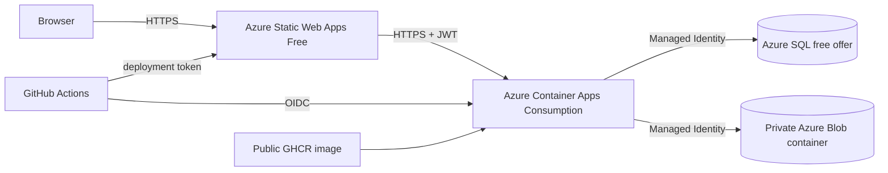

# Azure staging deployment

CivicFlow staging uses Azure Static Web Apps Free for the React client, Azure Container Apps Consumption for the API, the Azure SQL Database free offer, and a private container in a Standard LRS storage account. The API image is public in GitHub Container Registry; no ACR, NAT Gateway, Private Endpoint, Defender plan, or paid support plan is required.

## Cost guardrails

- Subscription budget: 10 in the billing currency, evaluated monthly, with actual alerts at 50%, 80%, and 100% plus a forecast alert at 100%.
- SQL: `useFreeLimit=true`, 32 GB maximum, 100,000 vCore seconds per month, local-redundant backup storage, and `freeLimitExhaustionBehavior=AutoPause`.
- Container Apps: Consumption only, 0.5 CPU/1 GiB, minimum replicas 0 and maximum replicas 1.
- Log Analytics: 30-day retention and a 0.1 GB daily cap. The cap is a guardrail, not a precise hard stop.
- Blob: Standard LRS, HTTPS/TLS 1.2, anonymous Blob access disabled, private container, and application limits of 10 MB per file and five files per case.

Do not enable paid SQL fallback, dedicated Container Apps workload profiles, geo-redundancy, Defender, ACR, NAT Gateway, Private Endpoint, or paid support without a separate review.

## Runtime identity

The API uses its system-assigned managed identity. Grant it `Storage Blob Data Contributor` at the attachment container or storage account scope. In the CivicFlow database, create a contained user for the identity and grant only the runtime permissions required by the application. Run EF migrations with a separate controlled deployment identity; the API identity must not retain `db_owner` or schema-owner rights.

Runtime configuration is supplied through Container Apps secrets and environment variables. Never commit or print values for JWT signing material, demo credentials, SQL administrator credentials, deployment tokens, or identifiers used for federation.

Azure SQL uses Microsoft Entra-only authentication. The server firewall contains only Azure SQL's `0.0.0.0` Azure-services rule; it must never contain an all-internet range or a retained developer IP. This is the no-NAT/no-private-endpoint staging compromise: authentication and least-privilege database grants remain the primary boundary. Production deployments should reassess private networking before handling real data.

Run migrations under the designated Entra deployment administrator, then create a contained user for the Container App system-assigned identity. Grant that user only `db_datareader`, `db_datawriter`, and any narrowly required execute permissions; never grant `db_owner` or DDL rights. After the one-time initialization, keep `DatabaseMigration__AutoMigrate`, `DatabaseInitialization__SeedReferenceData`, and `DemoAccounts__Enabled` disabled and remove the demo password from the Container App configuration.

Required API configuration names:

- `ConnectionStrings__CivicFlowDatabase`
- `Jwt__Key`, `Jwt__Issuer`, `Jwt__Audience`
- `ClientOrigin`
- `DatabaseMigration__AutoMigrate`
- `DatabaseMigration__EnableLegacyBaselineRegistration`
- `DatabaseMigration__ApplyPhase2UpgradeBeforeBaseline`
- `DatabaseInitialization__SeedReferenceData`
- `DemoAccounts__Enabled`, `DemoAccounts__Password`
- `FileStorage__ServiceUri`, `FileStorage__ContainerName`, `FileStorage__UseManagedIdentity`
- `FileStorage__SoftDeleteRetentionDays`

For Azure SQL managed-identity authentication, use an encrypted connection string with `Authentication=Active Directory Default`. Do not place an SQL password in the runtime connection string.

## GitHub deployment

The API workflow builds `deploy/api/Dockerfile`, publishes an immutable SHA tag to public GHCR, signs in to Azure using GitHub OIDC, and updates the existing Container App. Configure the `azure-staging` GitHub environment with:

- secrets: `AZURE_CLIENT_ID`, `AZURE_TENANT_ID`, `AZURE_SUBSCRIPTION_ID`
- variables: `AZURE_RESOURCE_GROUP`, `AZURE_CONTAINER_APP_NAME`

The frontend workflow validates the Vite client and uploads the existing `dist` output to Static Web Apps. Configure:

- secret: `AZURE_STATIC_WEB_APPS_API_TOKEN`
- variable: `AZURE_API_BASE_URL` (the API URL ending in `/api`)

`staticwebapp.config.json` supplies the SPA navigation fallback and response security headers. The API `ClientOrigin` must be the exact Static Web Apps HTTPS origin.

## Release verification

Verify `/health`, SPA deep-link refresh, CORS, TLS, role isolation, request creation, public messaging, notifications, attachment upload/download/delete capabilities, migration history, scale-to-zero recovery, and persistence across a new Container Apps revision. Confirm SQL remains on the free offer and review Cost Management after deployment.
