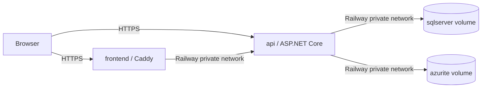

# Railway staging deployment

This runbook deploys CivicFlow as four Railway services in one staging project. Only `frontend` and `api` receive public domains. SQL Server and Azurite communicate exclusively over Railway private networking and retain data in mounted volumes.

## Service definitions

| Service | Source | Public | Volume |
| --- | --- | --- | --- |
| `frontend` | repository, `deploy/frontend/Dockerfile` | Yes | None |
| `api` | repository, `deploy/api/Dockerfile` | Yes | None |
| `sqlserver` | `mcr.microsoft.com/mssql/server:2022-latest` | No | `/var/opt/mssql` |
| `azurite` | `mcr.microsoft.com/azure-storage/azurite:3.35.0` | No | `/data` |

Use the Azurite start command `azurite-blob --blobHost 0.0.0.0 --location /data --skipApiVersionCheck`. Do not generate public domains for either infrastructure service. Use Railway's internal DNS names in API configuration.

The frontend image serves the Vite build with Caddy, proxies `/api` to `API_UPSTREAM`, exposes `/healthz`, and falls back to `index.html` for React Router deep links. The API validates Railway's `PORT`, binds `0.0.0.0`, and exposes `/health`.

## Variables

Configure values in Railway; never commit them. Names required by each service are listed below without values.

### SQL Server

- `ACCEPT_EULA`
- `MSSQL_PID`
- `MSSQL_SA_PASSWORD`

### Azurite

No secret is required by the container itself. Keep its private endpoint and account connection details in the API service only.

### API

- `PORT`
- `ASPNETCORE_ENVIRONMENT`
- `ConnectionStrings__CivicFlowDatabase`
- `Jwt__Key`
- `Jwt__Issuer`
- `Jwt__Audience`
- `ClientOrigin`
- `DatabaseMigration__AutoMigrate`
- `DatabaseMigration__EnableLegacyBaselineRegistration`
- `DatabaseMigration__ApplyPhase2UpgradeBeforeBaseline`
- `DatabaseInitialization__SeedReferenceData`
- `DemoAccounts__Enabled`
- `DemoAccounts__Password`
- `FileStorage__ConnectionString`
- `FileStorage__ContainerName`
- `FileStorage__UseManagedIdentity`
- `FileStorage__SoftDeleteRetentionDays`

### Frontend

- `PORT`
- `API_UPSTREAM`
- `VITE_MAP_TILE_URL` (optional build variable)
- `VITE_MAP_ATTRIBUTION` (required when overriding the tile URL)

Set the API and frontend service ports to a stable internal value such as `8080`. `API_UPSTREAM` must use the API service's Railway private DNS name and internal port. `ClientOrigin` must exactly match the public frontend origin. The frontend itself calls `/api` on the same public origin, so Caddy performs the private hop without exposing SQL Server or Azurite.

## Fresh staging database

For a brand-new staging database only, explicitly enable `DatabaseMigration__AutoMigrate` and `DatabaseInitialization__SeedReferenceData`. Enable `DemoAccounts__Enabled` only when a controlled staging demo is required and store `DemoAccounts__Password` as a Railway secret. This combination applies reviewed EF migrations under the existing application lock, creates reference categories, and seeds demo identities only when the database has no users.

Production defaults remain fail-closed: automatic migration and reference/demo seed are disabled unless explicitly configured. Production releases should apply the reviewed migration bundle described in the [migration runbook](migration-runbook.md), leave `DemoAccounts__Enabled` and `DatabaseInitialization__SeedReferenceData` disabled, and never publish Staff or Administrator credentials.

## Deployment order

1. Create the private `sqlserver` service, attach `/var/opt/mssql`, configure its variables, and wait for startup.
2. Create the private `azurite` service, attach `/data`, configure its start command, and wait for its blob endpoint.
3. Deploy `api` from `deploy/api/Dockerfile`; configure private SQL/Azurite endpoints and the staging-only initialization flags.
4. Generate the API public domain and verify `/health` returns HTTP 200.
5. Deploy `frontend` from `deploy/frontend/Dockerfile`, set `API_UPSTREAM` to the private API endpoint, then generate its public domain.
6. Set `ClientOrigin` to the final frontend HTTPS origin and redeploy the API.
7. Verify frontend `/healthz`, SPA deep-link refresh, registration/login, request creation, attachment upload/download, and role boundaries.

## Persistence and redeploy check

Create a staging-only resident, case, and attachment. Record non-sensitive identifiers, redeploy all four services without removing either volume, and confirm the case and attachment remain accessible. Review deployment logs for migration, schema, SQL, Blob, or CORS errors. Never validate persistence by using a real CivicFlow database or by importing a local backup.

## Rollback

Keep the previous successful Railway deployment available. If application startup, migration, or health checks fail, stop promotion and roll the stateless API/frontend services back to that deployment. Do not delete or recreate volumes. A database migration rollback requires a reviewed compensating migration or a verified staging backup restore; never use `EnsureDeleted` or remove migration-history rows.
